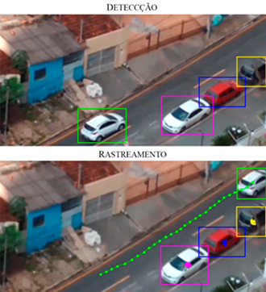

# Car Speed Detection

A car speed detector using CNN for recognition and OpenCV for tracking.



## Quick Start

### Prerequisites

- Python 3.6.x
- TensorFlow 0.8
- OpenCV 3
- PySDL2

### Running
Use NPM to start the server

```bash
python drawLine+NN.py
```
### Example Output


## Author
Vitor Bruno de Oliveira Barth - [vbob](http://github.com/vbob)

## License
This project is developed and mantained under the MIT license. 
